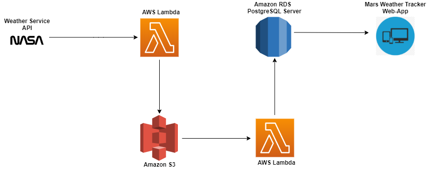

# Mars Weather Tracker

This project collects historical mars weather data collected my NASA's curiosity rover and diaplays it using various visualisations
in a web-application. The web-application is updated with the latest weather data on Mars every week. 

The architecture below is used to automate the pocess of collecting, transforming, storing and retireving the data used in the web-application.

Forecasts from trained models alongside observed data were visualised via a web-app (demo below): 

