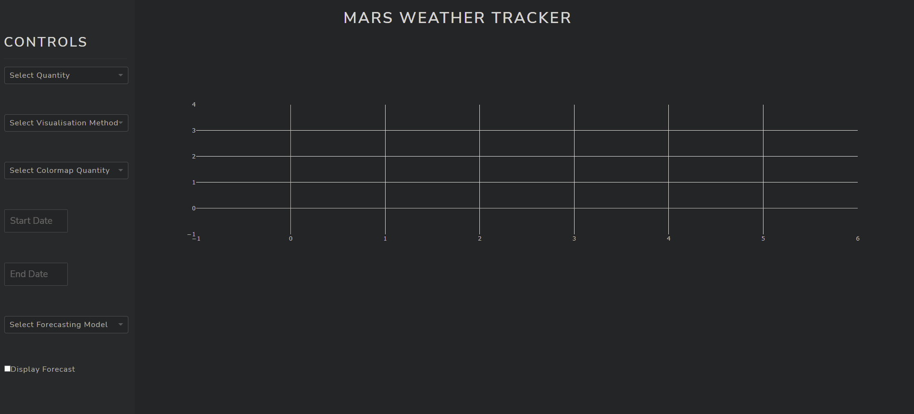

# Mars Weather Tracker

This project collects historical mars weather data collected my NASA's curiosity rover and diaplays it using various visualisations
in a web-application. The web-application is updated with the latest weather data on Mars every week. 

The architecture below is used to automate the process of collecting, transforming, storing and retireving the latest mars weather data displayed in the web-application.

A demo of the web application used to visualised forecasts from trained models (RNN, LSTM) alongside daily observations of the following quantities which describe the Martian atmosphere: 
- Maximum air temperature
- Minimum air temperature
- Maximum ground temperature
- Minimum ground temperature
- Atmospheric Pressure

